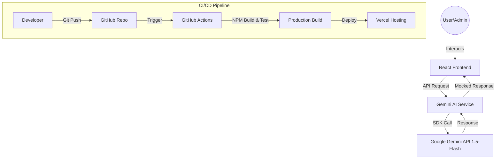

# OmniAI Multichannel Dashboard


A premium, AI-powered multichannel CRM dashboard built for modern customer support teams. This application integrates Google's Gemini AI to provide smart reply suggestions and automated customer intent analysis across various communication channels.

## ✨ Key Features

- **🚀 AI-Powered Chat**: Smart reply suggestions using Gemini 1.5-Flash to speed up response times.
- **🏷️ Automated Tagging**: AI analyzes chat history to automatically categorize customers (VIP, Potential, Support, etc.).
- **💬 Multichannel Inbox**: Unified interface for managing conversations from multiple sources.
- **📊 Real-time Dashboard**: Overview of support metrics, active chats, and customer distribution.
- **👥 Customer Database**: Comprehensive management of customer profiles and interaction history.
- **⚡ Modern UI/UX**: Built with Framer Motion for smooth animations and a premium glassmorphism aesthetic.
- **🛠️ AI Training View**: Dedicated interface for fine-tuning AI behavior and monitoring performance.

## 🛠️ Tech Stack

- **Frontend**: React 19, TypeScript, Vite
- **Styling**: Tailwind CSS, Framer Motion
- **Icons**: Lucide React
- **AI**: Google Gemini SDK (`@google/genai`)
- **Testing**: Vitest (Unit), Playwright (E2E)
- **DevOps**: Docker, GitHub Actions (CI)

## 🏗️ System Architecture

The following diagram illustrates the high-level architecture and data flow of the OmniAI Dashboard:



### Architecture Components:
- **Presentation Layer**: React 19 components styled with Tailwind CSS and animated with Framer Motion.
- **Service Layer**: Handles direct communication with the Google Generative AI SDK.
- **Data Layer**: Currently utilizes comprehensive Mock Data (Demo Mode) with AI-powered intent analysis.
- **Automation Layer**: GitHub Actions for Continuous Integration (Unit Testing & Build Verification).

## 🚀 Getting Started

### Prerequisites

- Node.js (v20 or higher)
- npm or yarn
- Google Gemini API Key (Get it from [Google AI Studio](https://aistudio.google.com/))

### Installation

1. Clone the repository:
   ```bash
   git clone https://github.com/your-username/multichannel-dashboard.git
   cd multichannel-dashboard
   ```

2. Install dependencies for the frontend:
   ```bash
   cd frontend
   npm install
   ```

3. Set up environment variables:
   Create a `.env` file in the root directory (or use `.env.local` in the `frontend` folder):
   ```env
   GEMINI_API_KEY=your_api_key_here
   ```

4. Start the development server:
   ```bash
   npm run dev
   ```

## 🐳 Docker Usage

You can run the entire application using Docker Compose:

```bash
# Build and start the container
docker-compose up --build
```
The application will be available at `http://localhost:8080`.

## 🤖 CI/CD Workflow

This project includes a automated GitHub Actions workflow (`.github/workflows/ci.yml`) that:
- Runs unit tests on every push and pull request to the `main` branch.
- Verifies that the production build is successful.

**Note**: To make the CI work, you must add `GEMINI_API_KEY` to your GitHub Repository Secrets.

## 📁 Folder Structure

```text
multichannel-dashboard/
├── .github/workflows/     # CI/CD pipeline definitions
├── frontend/              # React application source code
│   ├── src/
│   │   ├── components/    # Reusable UI components
│   │   ├── services/      # AI and external API integrations
│   │   ├── types/         # TypeScript definitions
│   │   └── constants.tsx  # Mock data and application constants
│   ├── __tests__/         # Unit and E2E tests
│   └── Dockerfile         # Frontend build definition
├── docker-compose.yml     # Container orchestration
└── README.md              # Project documentation
```

## 📜 License

Distributed under the MIT License. See `LICENSE` for more information.

---

Built with ❤️ by [Jasen Alfatama](https://github.com/jasenalfatamaa)
